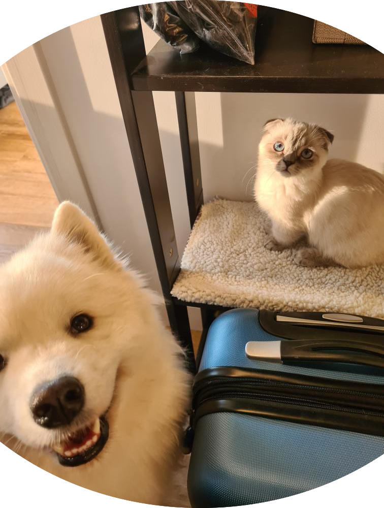

# **What this Website is for**

This website is a way for me to document R codes that I've written, and for me to create a repository of R and Stats guides so that I (and others, whoever you maybe!) can reference! This is by no means a professional guide - it's more of a space for me to play around and learn different tools! 

 

## About Me

I'm currently a graduate student at Yale University, doing research in the intersection of epidemiology, biostatistics, and data science! Previously, I was a bioengineering major at McGill University in Canada. 

Feel free to reach out to me if you have any questions, concerns, or would just like to chat (and perhaps buy me coffee!)

 

## *Who's in the adorable picture?*
That's Yuki and Koya — two of my favorite pets (I'm not their owners though, but I spent a lot of time taking care of Yuki for my friend)

